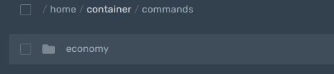
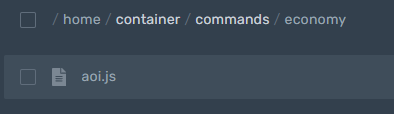

# Обработчик команд

## Основной файл index.js

Основной файл позволит вам запускать бота и сохранять команды!

```javascript
const Aoijs = require("aoi.js")
 
const bot = new Aoijs.Bot({
 sharding: false, // true - есть шарды. false - нет шардов 
  shardAmount: 2, // Кол-во шардов 
  mobile: false, // true - Включить активность с телефона. false - Активность с ПК
  token: "TOKEN", // Токен бота
  prefix: ["PREFIX"] // Измените PREFIX на нужный
})
 
bot.onMessage() // Нужно что бы команды выполнялись
bot.loadCommands(`./commands/`) // Нужно что бы команды выполнялись из папки с командами
bot.command({
name: "ping", 
code: `Pong! \`$ping\`` 
})
```

## Настройки файлов обработчика команд


Создайте папку с именем "commands"




Создайте подпапку с любым названием





Создайте в подпапке файл с любым названием и расширением .js





Вставьте ваш код команды в этот файл


```javascript
module.exports = ({
      name: "Название команды",
      code: `Ваш код команды`
})
```

